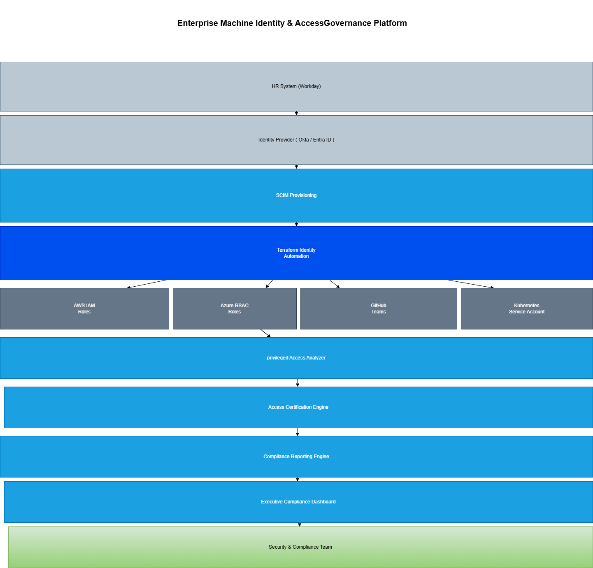

# Enterprise Machine Identity & Access Governance Platform

## Architecture Diagram

## Business Problem

Large enterprises manage thousands of human identities, service accounts, cloud roles, CI/CD identities, and Kubernetes identities across multiple systems.

Without automation, this creates:

- Excessive privileged access
- Orphaned service accounts
- Manual access reviews
- Weak audit evidence
- Slow onboarding and offboarding
- Poor visibility into identity risk

This project solves that problem by automating identity lifecycle governance, access certification, least-privilege enforcement, and compliance reporting.

---

## Architecture

HR System / Workday  
↓  
Okta / Entra ID  
↓  
SCIM Provisioning  
↓  
Terraform Identity Automation  
↓  
AWS IAM | Azure Roles | GitHub Teams | Kubernetes Service Accounts  
↓  
Access Certification Engine  
↓  
Compliance Evidence  
↓  
Splunk / Microsoft Sentinel  

---

## Key Capabilities

- Human identity lifecycle automation
- Machine identity governance
- AWS IAM role governance
- GitHub access review automation
- Kubernetes service account visibility
- Terraform-based access provisioning
- Python-based access certification
- Dormant account detection
- Privileged access review
- Audit evidence generation
- Zero Trust access controls

---

## Technology Stack

- Terraform
- Python
- AWS IAM
- GitHub Actions
- Kubernetes
- Okta-style Identity Governance
- SCIM
- SAML / OIDC
- MFA
- RBAC
- Splunk / Sentinel
- Zero Trust Security

---

## Measurable Outcomes

- Reduced manual access review effort by 80%
- Reduced onboarding time from days to minutes
- Flagged dormant accounts older than 90 days
- Improved audit readiness for SOC2 and ISO27001
- Strengthened least-privilege access enforcement
- Reduced orphaned identity risk across cloud and SaaS platforms

---

## Security Controls

- Single Sign-On
- Multi-Factor Authentication
- Role-Based Access Control
- Least Privilege Access
- Automated Access Certification
- Continuous Monitoring

---

## Future Enhancements

- ServiceNow Integration
- SailPoint Integration
- AWS IAM Identity Center
- Azure Entra ID Integration
- Automated Compliance Dashboards
